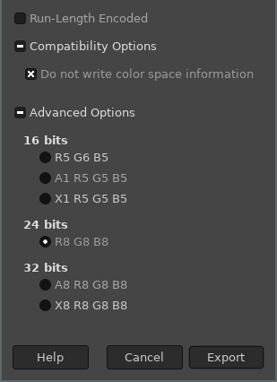
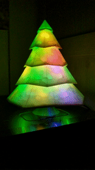
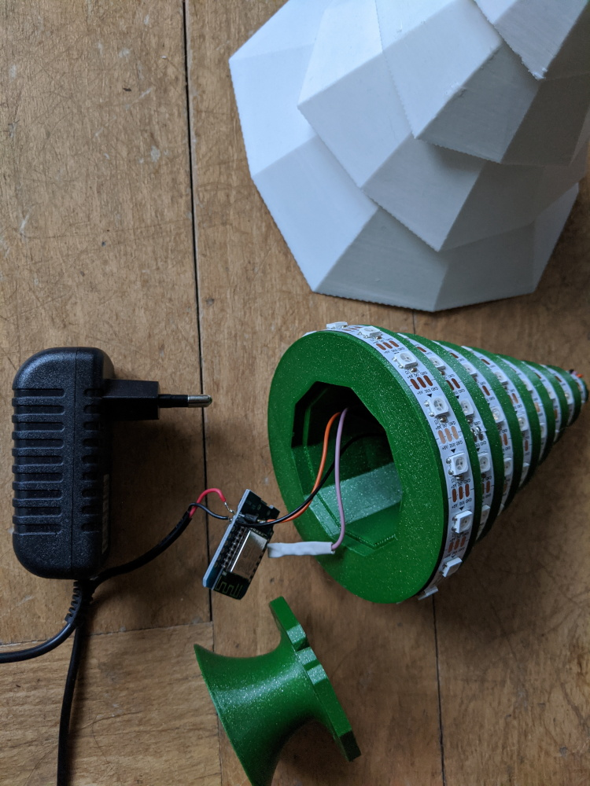
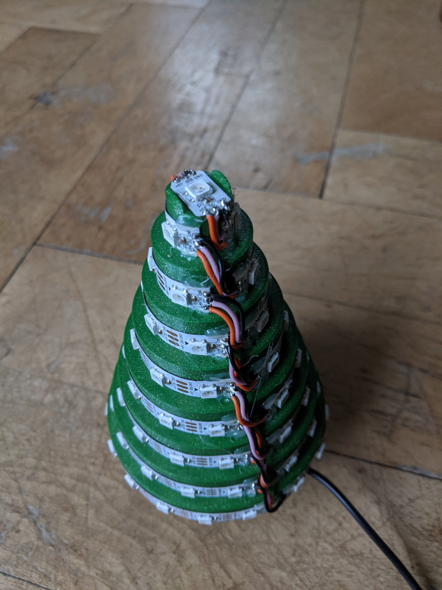

# led-decorations
ESP8266 software for driving LED strips, connected to WiFi and MQTT.

## Electronics
See the schematic in the "electronics" folder.

The diode is used to lower the LED strip supply voltage so that it works with the 3.3V output of the ESP8266. See details here: https://hackaday.com/2017/01/20/cheating-at-5v-ws2812-control-to-use-a-3-3v-data-line/

The resistor removes spikes (much cleaner signal), a slightly different value should work fine.

- ESP8266 D1 mini module: https://www.aliexpress.com/item/32633763949.html
- WS2812B LED strip: https://www.aliexpress.com/item/2036819167.html (IP30 version for the Christmas tree, IP67 version for outdoor use)
- 5V power supply: https://www.aliexpress.com/item/33014935336.html (2A is enough for the Christmas tree)
- 1N4007 diode
- 220ohm resistor

## Outdoor lights
The LED strip is installed as shown in the picture below. The vertical segments (25 LEDs) are used as a matrix, the horizontal segments (3 LEDs) are currently not used.
I used a spreadsheet, exported the matrices as csv and did some copy-pasting to define the ledmap.hpp content.

## Bitmap files (ScrollingPicture animation)
The .bmp files displayed by the ScrollingPicture animation can be generated with the GIMP. Its height must match the height of the pixel matrix. The width does not matter.
The file must be saved using these options:

These files must then be uploaded to SPIFFS. Place them in the "data" folder and execute the PlatformIO task "Upload File System image".

## Christmas tree
This code can also be used for a 3D printed christmas tree: https://www.youmagine.com/designs/led-christmas-tree

Someday it might be possible to only change the configuration file, but for now you have to use the ".TREE-EXAMPLE" versions of the following files: main.cpp, config.hpp, ledmap.hpp. The LED matrix in the ledmap.hpp file is composed of a single row.

Components of the Christmas tree:

Detail of the LED strip:

More pictures in the "images" folder.
